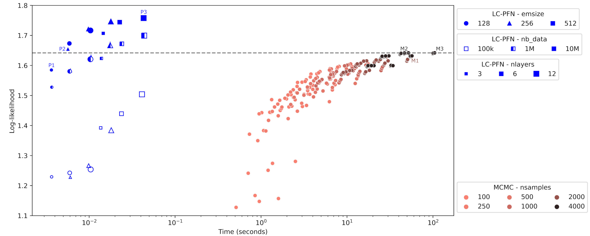
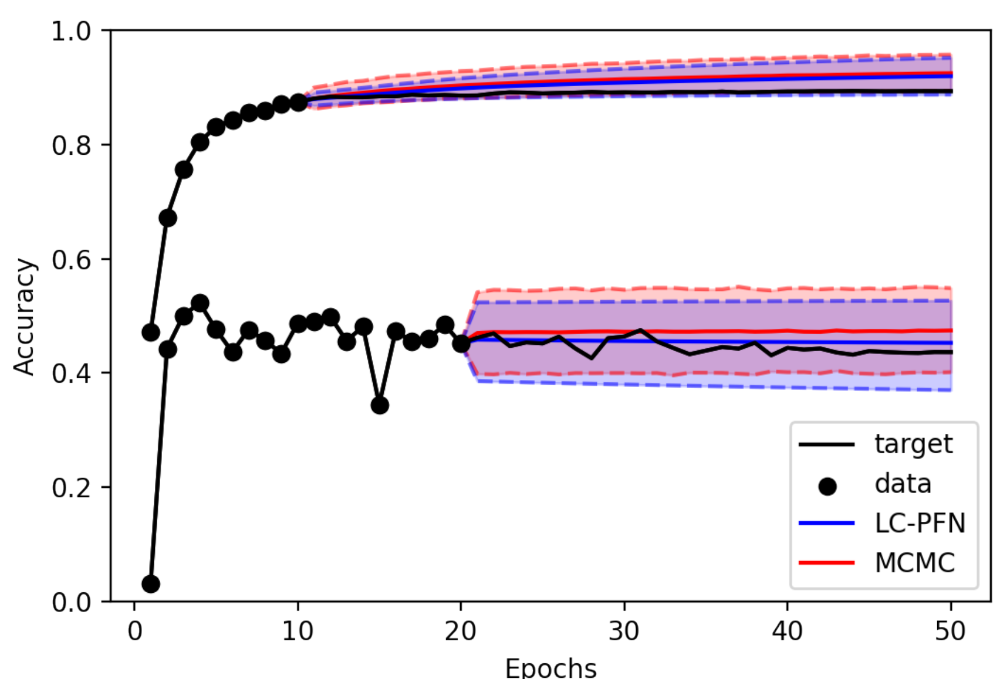
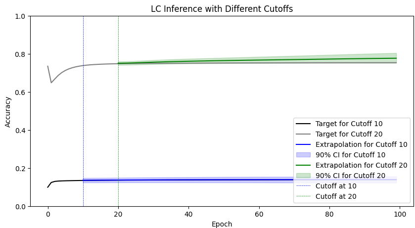

# Blog for: Efficient Bayesian Learning Curve Extrapolation using Prior-Data Fitted Networks
|Name| Email | StudentID | Task |
|:---:|:---:|:---:|:---:|
|Arthur Mercier | A.G.Mercier@student.tudelft.nl | 5056195 | Variant (Positional encoding) & Simplifying Transformer |
|Remi Lejeune | R.J.Lejeune@student.tudelft.nl | 5040841 | Variant (Positional encoding) & Simplifying Transformer |
| Marin Jaić | M.Jaic@student.tudelt.nl | 6075185 | Ablation study & adapting model to new dataset |
| Patrik Kukić | P.Kukic@student.tudelft.nl | 6066559 | Ablation study & adapting model to new dataset |
| António Costa Bernardes | acostabernarde@tudelft.nl | 5851904 | Reproducing paper results: inference LC-PFN & MCMC |
## Introduction

In the machine learning field, where computational requirements are fast increasing with the needs for more powerful predictive models, being able to predict a model’s training performance when given more resources would be of great benefit for training efficiency both time and cost-wise.

The paper "Efficient Bayesian Learning Curve Extrapolation using Prior-Data Fitted Networks" [1] addresses this issue by innovating within the domain of learning curve extrapolation by employing a Bayesian approach tailored to handle the intrinsic uncertainties of predicting machine learning model performance over the training process. Traditional methods, while effective, often pose limitations due to their computational expense or restrictive assumptions on the data. This research offers an alternative by utilizing Prior-Data Fitted Networks (PFNs) for learning curve inference – dubbed Learning Curve Prior-Data Fitted Networks (LC-PFNs), which leverage transformer architectures to perform Bayesian inference efficiently and flexibly.

Building on the work presented in [2], who introduced a parametric model for learning curve extrapolation using Markov Chain Monte Carlo (MCMC) methods, this paper advances the field by dramatically enhancing computational efficiency. Notably, LC-PFNs can deliver at leaset equally accurate extrapolations more than 10,000 times faster than traditional MCMC methods, providing a potent tool for applications like automated machine learning and hyperparameter optimization where quick, reliable forecasts can significantly accelerate decision-making processes. Figure 1, obtained from [1] compares the reported performance in terms of log-likelyhood vs. Inference runtime.
Naturally, as the authors point out, this increase in performance comes at the cost of a one-time significant overhead of traininf the LC-PFN.

In their methodology, the authors initially develop and test their proposed model using a set of informative priors (obtained from building upon Dohman uninformative priors) to sample learning curves that are used for training and inference. Subsequently, the LC-PFN model is rigorously tested with real-world data and evaluated for its effectiveness in predictive early stopping based on its forecasts. In almost all cases, the LC-PFN model matches or exceeds the accuracy of the MCMC model, while performing the inference step thousands of times faster.

In this blog post, an initial reproduction of the obtained results will be attempted using the authors’ original code as faithfully as possible. Following the replication, the focus will shift to adapting the original codebase to leverage the tools provided by PyTorch, particularly the Transformer class. Notably, in [1] the authors develop a custom and quite convoluted implementation of the transformer model. By porting the model to utilize PyTorch’s built-in Transformer modules, the expectation is to streamline the architecture and potentially enhance computational efficiency and maintainability of the code. Finally, the original implementation will be put to further testing using an increased set of real-world data.

## Reproducing the obtained results

The initial goal was to replicate the learning curve inference demonstrated by both the LC-PFN and the MCMC models using the authors' original code with minimal changes. Success was defined by the ability to recreate an image similar to Figure 2, obtained from the original paper [1], showing the inference from both models of two curves with different cutoffs at 10 and 20.

The hardware used in this section and the equivalent used in the original paper is listed in Table 1.
| | LC-PFN Training and inference | MCMC fitting and inference |
|--------------------|-------------------------------|-------------------------------|
| Original paper | single RTX2080 GPU | single Intel(R) Xeon(R) Gold 6242 CPU |
| Reproduction | Single T4 GPU | single Intel(R) Core(TM) i7-8550U CPU |

_Table 1: Hardware used in the original paper [1] and in the reproduction_

### Inference with LC-PFN

The first step was to obtain a trained LC-PFN model. To this end, the interface provided by the authors for trying such models was used.

The model was set to handle sequences of length 100 and included an embedding size of 256 and 3 layers. This architecture was chosen to mimic that of the smaller model tested by the authors, thus testing if the least powerful model highlighted in the paper is indeed able to achieve satisfactory results. The model was trained with a batch size of 500 for 300 epochs (a total training time of slightly less than five hours compared to the total of around 8 hours mentioned in the paper for the largest model).

After training the model, it was put to the test with two target curves shown with cutoffs 10 and 20 as previously mentioned. The target curves and the network’s predictions when fed 10 or 20 epochs of each curve are shown in Figure X. The result is, indeed, quite satisfactory and as such the reproduction of the LC-PFN pipeline from training to inference using the authors’ code is considered successful.

### Inference with MCMC

Moving on to the reproduction of the inference capabilities of the MCMC model, again, the code provided by the author’s was analyzed in order to find the correct pipeline for using this model. Unlike in the case of the LC-PFN, however, there is no “training process” in the sense that the term used in deep learning. Instead, each model is obtained by fitting it to a portion (up to the cutoff) of the sequence to be predicted.

The reproduction process, unlike that of the LC-PFN, was unsuccessful. This was due to the sheer amount of runtime required by the MCMC model. Of course, the main objective of the paper is to demonstrate that the prediction runtime of the LC-PFN is much faster than that of the MCMC model, however, the required runtime observed during reproduction was incomparably larger than that reported by the authors. Take as an example Table 2 which lists the runtimes reported by the authors as well as that observed in the reproduction, where the mentioned discrepancy is clearly visible.
| Source | Parameters | Avg. Time (seconds) |
|---------------|----------------------------------------------|---------------------|
| Original Paper| nsamples = 2000, nwalkers = 100, burn-in = 500, thin = 1 | 54.401 |
| Original Paper| nsamples = 4000, nwalkers = 100, burn-in = 100, thin = 100 | 45.160 |
| Original Paper| nsamples = 4000, nwalkers = 100, burn-in = 500, thin = 1 | 103.151 |
| Original Paper| Nsamples = 100, nwalkers = 100, burn-in and thin unknown | ~1 |
| Reproduction | Nsamples = 100, nwalkers = 100, burnin = 10, thin = 1 | 2190.6 |

_Table 2: Comparison in MCMC runtimes_

Note that, indeed, the hardware used in the reproduction process is not as powerful as what was used in the original study. Nevertheless, given the magnitude of the discrepancy, it is very unlikely that this was a main cause for it.

In addition, when this issue was first noticed, the possibility that the added runtime ocurred due to misuse of the authors’ code was, naturally, considered. To reduce the risk of such an error being responsible for the irreproducibility, the exisiting codebase was once more analyzed in order to find a example of how to construct, fit, and conduct inference with an MCMC model. Such an example was found in a method responsible for building from scratch and evaluating MCMC models and used as a comparison to correct possible mistakes. However, the re-implementation and the example implementation utilized the pipeline in the same manner. This agreement between the re-implementation and the authors’ own implementation make it very unlikely that an implementation error during reproduction is responsible for the issue at hand.

## Simplifying the Transformer using PyTorch:

The code used to build the transformer model presented by the paper [1] spans 16 different files totaling several thousands of lines. In this chapter we attempt to replicate their model by building a transformer model using Pytroch libraries. This would improve the readability of the code and remove the thousands of lines of code now made redundant due to the integration of PyTorch.

We iterated through 4 different models as shown in Table 3. Each model was trained with 6400 curves in batches of 64, was made up of 4 layers and 8 multi-attention heads. The first was a transformer model trained with a model dimension of 128 and a feed forwards dimension of 512. Due to the first model’s poor performance, we lowered the dimensions of our second model. The idea behind this was that a simpler model might generalize better of the dataset. This did not improve the performance overall, indicating the problem to be more complex than simply overfitting.

Our third model consisted of the same parameters as our second, but with the removal of forced teaching in our training algorithm. Instead of using the true values of the curve as inputs to the model when making its prediction, we instead give it its predictions of the previous points. This allows the loss to accumulate and be reflected in the total loss used to update the model parameters. Instead of the error of the model being refreshed at every prediction step, the model is punished for multiple wrong predictions in the same direction. Removing forced teaching creates a bigger incentive for the full predicted curve to remain closer to the target curve. For our last model we replaced the positional encoding with our own variant. This is further explained in the next chapter.

| Loss               | LCPFN          | Large Model (Forced teaching) | Small Model (Forced teaching) | Small Model | Small Model (Positional encoding: Euclidian distance) |
| ------------------ | -------------- | ----------------------------- | ----------------------------- | ----------- | ----------------------------------------------------- |
| Mean               | **0.0002**     | 2.3589                        | 3.2686                        | 1.9210      | 3.4749                                                |
| Standard Deviation | **8.0023e-05** | 0.3185                        | 0.5678                        | 0.2005      | 0.5448                                                |

_Table 3: Loss (mean and standard deviation) for each model. Code to train the models can be found in the 'training_models' jupyter notebook._

To compare the performance of our models and the paper’s model we measured the average loss of 10 predictions of 100 curves. The result of this can be seen in Table 3. The paper’s model (LCPFN) was shown to outperform all other models with a mean of 0.0002 and a standard deviation of 8.0023e-05. The small model without forced teaching was the best performing of our models with a mean of 1.9210 and standard deviation of 0.2005. The large model with forced teaching came third. The small model with forced teaching and the model with our variant positional encoding both had a similar result.

|                                                                                                               |
| :------------------------------------------------------------------------------------------------------------------------------------------------------------------------------------------------------------------------------------------: |
| _Figure 3:_ For 6 different target curves we plot the predicted curves of each of the 5 models. The models are given the first 15 points, after which they are tasked with predicting the following 85 points that make up the target curve. Code for testing the models and generating similar graphs can be found in the 'testing' jupyter notebook. |

Several trends can be observed when plotting the predictions of the models against target curves (see figure 6). More examples of plots can be found in our repository under ‘/graphs’. Firstly, the large model always predicts higher values than the true target curve and is always increasing, except when the generated target curve is already approaching the max value 1. Secondly, the small model with forced teaching appears to always tend towards a value of around 4.5. A possible explanation is that 0.45 is the mean of the training dataset and the model is attempting to minimize total loss by reaching that value. Lastly, we notice a collocation between the shape of the curves of models with forced teaching and the shape of the curve for models without. The models with forced teaching are able to achieve a smoother curve that straightens out, whereas the models with forced teaching taper off in either direction. As mentioned above, this is because forced teaching strongly incentivises the sum of point predictions not to deviate too hard in one direction.

## Positional Encoding:

Transformers do not take the position of its input data points into account. They treat each point as independent. But the order of the points in a curve are highly relevant, therefore we use positional encoding to give information on the order of the input sequence to the transformer. This is done by mapping each point of the curve to a positional vector. There exists many variants of positional encoding.

The paper implements 3 types of positional encodings, the standard sin-cos positional encoding, learned positional encoding and paired scrambled positional encoding. Sine-Cosine positional encoding is the most widespread technique. It encodes each point by alternatively applying these functions along the position vector. Intuitively, each point is mapped to a section of the sin/cos curve, giving it a value between -1 and 1. The frequency is adjusted to match the input length so that no two points have the same value.
$$P(k,2i) =  sin(\frac{k}{n^{2i/d}})$$
$$P(k,2i + 1) =  cos(\frac{k}{n^{2i/d}})$$

- K refers to the value of the point on the x-axis, its position in the input sequence.
- d is the length of the vectors we are encoding the points into (the number of columns in the encoding matrix).
- n = [0,99], it is the length of the input curve
- i indexes the columns of the encoding matrix for both sin and cos columns. 0 <= i <= d/2

Figure 1 shows an example computation of the positional encoding matrix.

|                     |
| :---------------------------------------------------------------------------------------------------------------------------------------: |
| _Figure 4:_ Encoding of 4 point sequence using standard (sin-cos) positional encoding where d = 4 and n = 4. Each row represents a point. |

The second positional encoding used by the paper is learned positional encoding. Instead of using a fixed mathematical model and equations, the positional encodings are learned with the model parameters during training. This allows for a more tailored embedding as it can be modeled to specific characteristics of the data.

The third and final encoding they use is paired scrambled positional encoding. This seems to be a custom implementation of the paper as we could not find other references to it. It inherits from the standard sin-cosine encoding mentioned above but goes on to group the embeddings into pairs, permuting them randomly before returning. Thus retaining some pairwise positional information but losing information on the total sequence. We are unsure of the direct use of this encoding though it might relate to regularizing or testing the generalization ability of the transformer model.

For our code variant we decided to implement a custom encoding. We created a positional encoding module based on the euclidean distance of the points position (x-value) to the start of the curve.  This is based on the assumption that points have a stronger effect on the points closer to them in the sequence. 

We went on to compare our euclidean positional encoding with the standard sin-cos positional encoding using our small (no forced teaching) model. As can be seen in the last two columns of table 3, standard positional encoding (Small model) has a mean loss of 1.921 with a standard deviation of 0.2, thus outperforms our euclidean encoding who's mean loss is 3.475 with a standard deviation of 0.54. One possible explanation for this is that euclidean encoding does not normalise its values depending on the sequence length. As standard encoding uses sin and cos functions, all values are bound by -1 and 1 no matter the length of the input. However, for euclidean distance, the upper bound will increase as the number of points increase. Normalising the euclidean distance values to be between 0 and 1 might help, however this would create a situation where the same point would normalise into different values based on the input size. Another interesting trend that can be seen in figure 3 is that the curve predicted with Euclidean distance encoding is always higher than with standard encoding.

## Testing their model on new data

The motivation behind extrapolating learning curves is hyperparameter optimization. Upon defining a model, it is often necessary to conduct cross validation, enumerating over many possible combinations of hyperparamters until the best one is found. Every combination of hyperparameters requires training of a new model instance which consumes considerable time and energy, especially if the model in question is complex. Thus, predicting the trend of the training curve during training would allow for earlier halting of the process, saving considerable time and resources.

Another great expense, when it comes to training models, is data collection. Complex models are often of little use when data for training them is sparse, and collecting data can often be very costly. It would hence be very convenient if one could predict how the learning curve of a model will behave with the increase in size of its training dataset. This idea is fairly analogous to what our paper tries to accomplish, simply substituting the x axis units which were epochs with training dataset size.

The work of Mohr, Viering et al. [3] was used to try and bring this idea to life. Their repository provides a means to easily access datasets describing learning curves in relation to the dataset size from openml.org in a convenient manner.
To access a curve one needs to define the dataset name or id and the learner used. By doing a carthesian product over all the dataset ids and learners, and ignoring those datasets for which the dataset size wasn't a dataset of some 44000 entries was assembled. Each learning curve, given by the pair (dataset, learner), contained the x-axis values, i.e. the dataset sizes scaling with the power of $\sqrt{2}$ . For every point on the x-axis, 125 points were given on the y-axis, each representing one observation of one training loop. These values were pooled using a simple average pooling. Since not all of the curves had the same amount of observations we decided to dropped all that did not have 12, 14, 16, 18, 20, 22, 24 or 26 observations, since more than 90% of them had the aformentioned observation sizes. Then, piecewise linear interpolation was performed which brought the number of the observations for every remaining curve to 26. In particular, a random sample within the range of $\left[x_{min}, x_{max}\right]$ of size $26 - \left| x \right|$ was added to the list of training sizes, and the $y$ values were recomputed, using the interpolation function, on this new list. Normalization over training dataset size was further performed, removing the datasets with unknown size beforehand. This final dataset was loaded into a json file for easier transport into the lcpfn framework.

For the implementation, the goal was to generate sensible plots and measure performance on a test set. The original, non-reproduced, lcpfn framework was used for this task in the hopes that it would minimize the probability of error. Still, the attempt was largely unsuccesful. The framework was very rigid and hard to adjust to this task. It required a lot of tinkering with the code to load the data and adjuts the models and the loss functions. The end result exhibited good training loss in the range of 0.02 which usually converged after only 3 epochs but upon generating plots, very bad performance was observed. This raised doubts about the whole training procedure and barely any formal testing was done. Plots are submitted as a formality. It is suspected that the model would have performed better if a bigger dataset were avaliable.

|                     |
| :---------------------------------------------------------------------------------------------------------------------------------------: |
| _Figure 5:_ LCPFN with different neural network sizes. Blue points are observations, green points are the actual values, red points are predicted accuracies.|

Additionaly, the model was adjusted and trained with different numbers of heads and linear layers. All the combinations with the encoding sizes of 256 and 128 coupled with layers of size 12, 10 and 8 were evaluated and showed unflattering performance upon visualization.

## Limitations

One of the main limitation of our project is the lack of computational resources. The results in the paper were produced with models traind on 100k to 10M curves. The models trained in the 'simplyfing to pytorch' chapter were trained on 6.4k curves. Training the models with similar resources would provide a fairer comparison with the paper's model.
In addition, the lcpfn framework has a very long and convoluted pipeline, is very hard coded, many of it's functions were never tested or used and were left there as remenants and it does not allow for simple model defining outside of calling the training loop. It required a lot of backwards engineering and overhauling to adjust it to some of the desired purposes. Note that the original work was not meant to be used in this fashion, still, it posed a challenge.

## Conculsion and future work
In this work a reproducing the functionalities and results of _Efficient Bayesian Learning Curve Extrapolation using Prior-Data Fitted Networks_ [1] is done. Additional implementations using the paradigm the paper presents is also attempted.   
## References

[1] Adriaensen, S., Rakotoarison, H., Müller, S., & Hutter, F. (2023). _Efficient Bayesian Learning Curve Extrapolation using Prior-Data Fitted Networks_. arXiv preprint arXiv:2310.20447. Available at: https://arxiv.org/abs/2310.20447

[2] Domhan, T., Springenberg, J.T., & Hutter, F. (2015). _Speeding Up Automatic Hyperparameter Optimization of Deep Neural Networks by Extrapolation of Learning Curves_. In Proceedings of the Twenty-Fourth International Joint Conference on Artificial Intelligence (IJCAI 2015).

[3] Mohr, Felix and Viering, Tom J and Loog, Marco and van Rijn, Jan N (2022). _Machine Learning and Knowledge Discovery in Databases_. Research Track - European Conference
